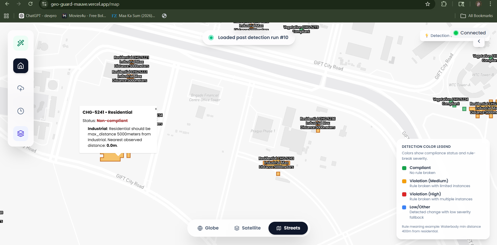
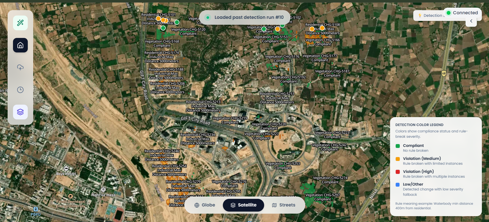
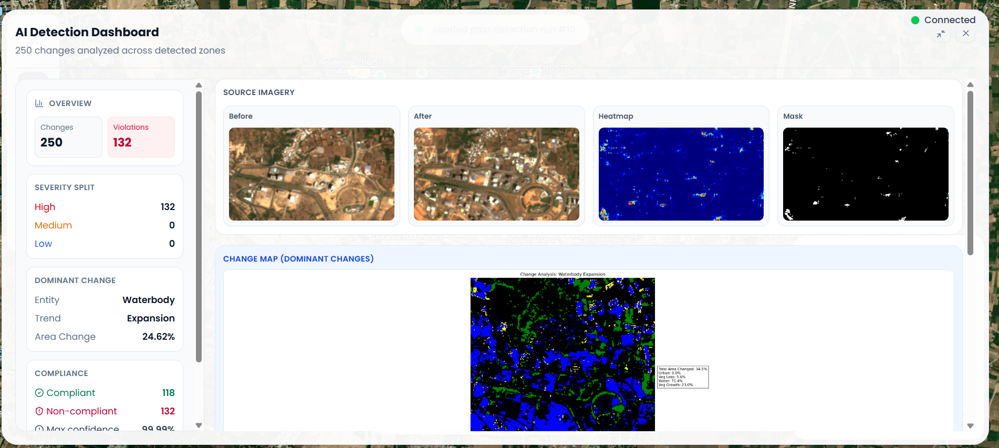

# GeoGuard

GeoGuard is an end-to-end geospatial intelligence platform for satellite change detection, rule-based compliance checking, and investigation workflows. It combines AI segmentation, PostGIS spatial analysis, complaint-document rule extraction, and an interactive map dashboard.

## What This Repository Includes

### 1. Python backend (`python-backend`)
- FastAPI service for AI inference, raster-to-vector conversion, compliance checks, and websocket updates.
- ONNX-based change detection pipeline (`best_siamese_unet.onnx`).
- Planetary Computer/STAC band fetching and spectral index analysis.
- Rule extraction pipeline from uploaded PDF documents.
- Postgres persistence for extracted rules, detection runs, and violation records.

### 2. Next.js web app (`website`)
- Landing experience and geospatial monitoring dashboard.
- Mapbox-powered map UI for detections and violations.
- Complaint PDF upload flow with S3 storage.
- Detection history and overall analytics APIs.
- Compliance report PDF generation API.

### 3. Geospatial and test assets
- Sample GeoJSON layers in `website/src/data`.
- Satellite image assets and tests in `python-backend/satellite_images` and `python-backend/test`.

## Core Functionalities

### AI change detection
- Accepts two time-separated satellite images and predicts change masks.
- Produces confidence outputs and generated change-map artifacts.
- Supports local inference orchestration that combines AI output with spectral and spatial logic.

### Spectral analysis and dominant change typing
- Computes NDVI, NDWI, and NDBI deltas from multi-band inputs.
- Classifies dominant trend categories such as urban expansion, vegetation change, and water-related changes.

### Raster-to-vector and compliance engine
- Converts raster masks to vector polygons.
- Evaluates each detected polygon against dynamic compliance rules stored in Postgres.
- Uses PostGIS operators and distance/area predicates.

### Complaint PDF to machine-readable spatial rules
- Uploads complaint/legal PDF files to S3.
- Triggers asynchronous extraction pipeline in FastAPI.
- Uses LLM parsing to convert legal text into normalized JSON spatial rules.
- Stores processed-file state to avoid duplicate reprocessing.

### Live updates and reporting
- WebSocket endpoint for detection progress and result broadcasting.
- Detection history and aggregated overview APIs for the dashboard.
- Compliance PDF report generator with summary, violations, and images.

## UI Preview

### 1. Detection Map View
The primary map interface showing detected change polygons, compliance labels, and geospatial context over satellite imagery.



### 2. Multi-Style Map Modes
Street/satellite mode switching for better visual analysis of compliance markers and surrounding road/building topology.



### 3. AI Detection Dashboard
Detailed run-level dashboard with before/after imagery, heatmap and mask outputs, dominant change insights, and compliance severity summary.



## Compliance Rule Engine

Rules are stored in JSON/JSONB and translated into dynamic PostGIS SQL at runtime.

### Supported entities
1. `waterbody`
2. `vegetation`
3. `residential`
4. `industrial`

### Supported spatial relations
- Topological: `intersects`, `within`, `disjoint`
- Proximity: `min_distance`, `max_distance` (meters)
- Attribute-based: `min_area`, `max_area` (sq meters)

### Example rule
```json
{
  "target_entity": "industrial",
  "reference_entity": "waterbody",
  "spatial_relation": "min_distance",
  "threshold_value": 50,
  "threshold_unit": "meters"
}
```

## API Surface Summary

### Python backend (FastAPI)
- `GET /rules`: fetch extracted compliance rules.
- `POST /pdf-uploaded`: queue PDF extraction pipeline.
- `POST /predict_change`: model inference on two images.
- `POST /gen_analyze_bands`: generate cropped band analysis inputs.
- `POST /analyze_separate_bands`: spectral change map generation.
- `POST /analyze_separate_bands_final`: dominant change classification.
- `POST /api/raster-to-vector`: raster mask to vector polygons.
- `POST /inference_local`: full pipeline (AI + vectorization + compliance + persistence + websocket broadcast).
- `GET /test`: test websocket broadcast.
- `WS /ws/ai-detections/{client_id}`: live event channel.

### Website (Next.js route handlers)
- `POST /api/complice`: upload complaint PDF to S3 and notify FastAPI.
- `POST /api/s3/signed-urls`: generate signed S3 object URLs.
- `GET /api/detections/history`: fetch recent detection runs.
- `GET /api/detections/overall`: fetch aggregated compliance summary.
- `POST /api/detections/report-pdf`: generate downloadable compliance report PDF.
- Seed utilities under `website/src/app/api/scripts/seed/*` for zone/water/vegetation/residential data import.

## Tech Stack

### Frontend
- Next.js (App Router)
- React
- Mapbox GL
- Prisma Client

### Backend and AI
- FastAPI
- ONNX Runtime
- Rasterio, NumPy, Pillow, scikit-image, Matplotlib
- Pystac Client + Planetary Computer
- PostgreSQL + PostGIS
- boto3 (S3)
- OpenAI-compatible client against Groq API (Llama models)

## Getting Started

### Prerequisites
- Docker Desktop (recommended for backend)
- Node.js 18+
- PostgreSQL with PostGIS enabled
- AWS S3 bucket and credentials
- Mapbox token

### 1. Clone repository
```bash
git clone https://github.com/Devan019/GeoGuard.git
cd GeoGuard
```

### 2. Python Setup (Docker)
Create `python-backend/.env` with at least:
- `DATABASE_URL`
- `AWS_ACCESS_KEY_ID`
- `AWS_SECRET_ACCESS_KEY`
- `AWS_REGION`
- `AWS_S3_BUCKET_NAME`
- `GROK_API_KEY`

Build and run:
```bash
cd python-backend
docker build -t geoguard-backend .
docker run --rm -p 8000:8000 --env-file .env geoguard-backend
```

Backend will be available at `http://127.0.0.1:8000`.

### 3. Website Setup
Create `website/.env` with at least:
- `DATABASE_URL`
- `NEXT_PUBLIC_MAPBOX_TOKEN`
- `NEXT_PUBLIC_SOCKET_URL` (example: `ws://127.0.0.1:8000/ws/ai-detections`)
- `AWS_ACCESS_KEY_ID`
- `AWS_SECRET_ACCESS_KEY`
- `AWS_REGION`
- `AWS_S3_BUCKET_NAME`
- `AWS_S3_COMPLAINTS_PREFIX` (optional)

Install and run:
```bash
cd website
npm install
npm run dev
```

Website will run at `http://localhost:3000`.

## Data and Database Notes

- Prisma schema is located at `website/prisma/schema.prisma`.
- Detection runs persist in `detect_details` and `rule_violations`.
- Rule extraction stores JSON rules in `compliance_rules`.
- Processed complaint files are tracked in `processed_files`.

## Repository Structure

```text
GeoGuard/
├── python-backend/
│   ├── api/                     # FastAPI routes and websocket endpoints
│   ├── services/                # DB, PDF, STAC, inference, vectorization services
│   ├── models/                  # Request/response schemas
│   ├── utils/                   # PDF processing helpers
│   ├── test/                    # Backend test and utility scripts
│   ├── Dockerfile
│   └── main.py
├── website/
│   ├── src/app/                 # Next.js app routes and map UI
│   ├── src/app/api/             # Web APIs for uploads, detections, reports, seeding
│   ├── src/context/             # Websocket provider
│   ├── src/lib/                 # Prisma and S3 clients
│   └── prisma/                  # Prisma schema
└── README.md
```

## License

Developed for the Satellite Imagery Change Detection challenge. Licensed under the MIT License.